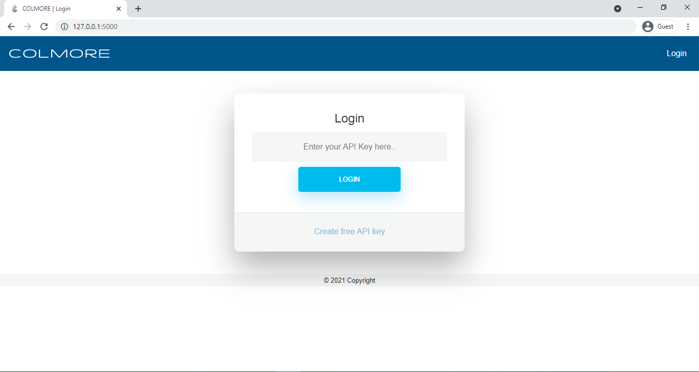
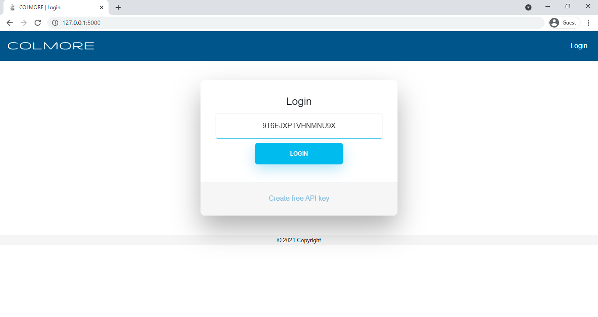
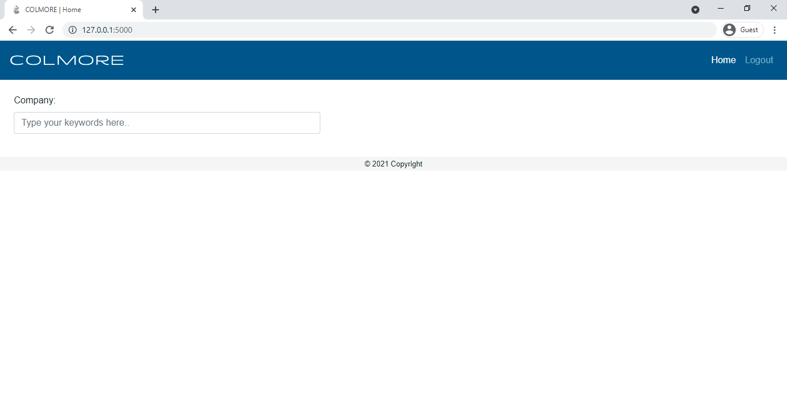
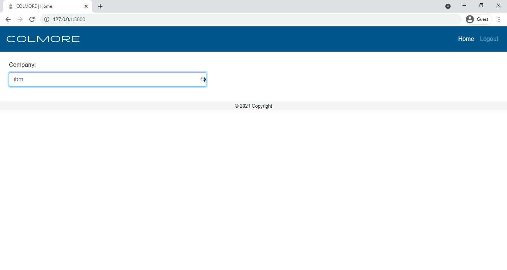
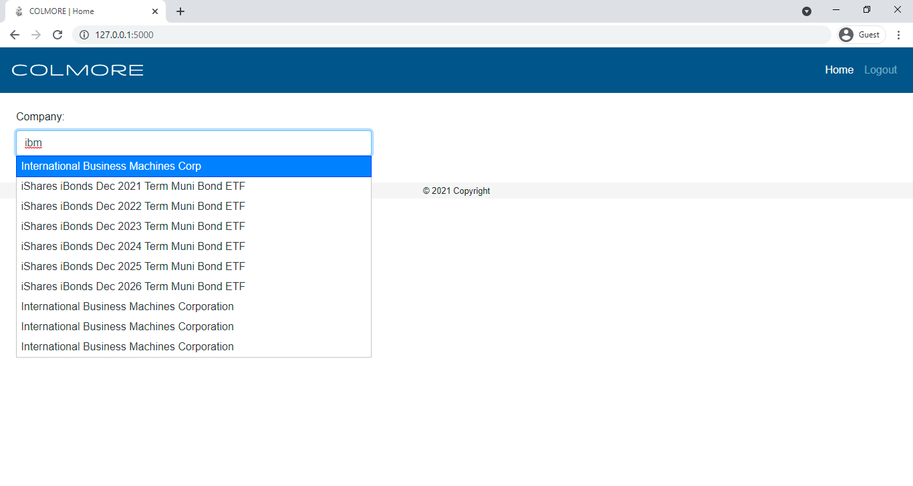
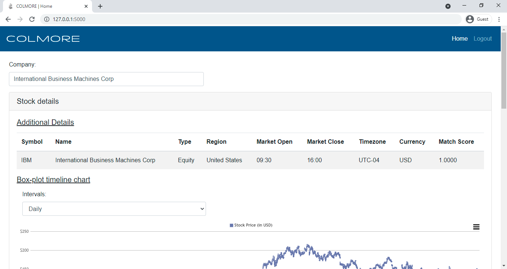
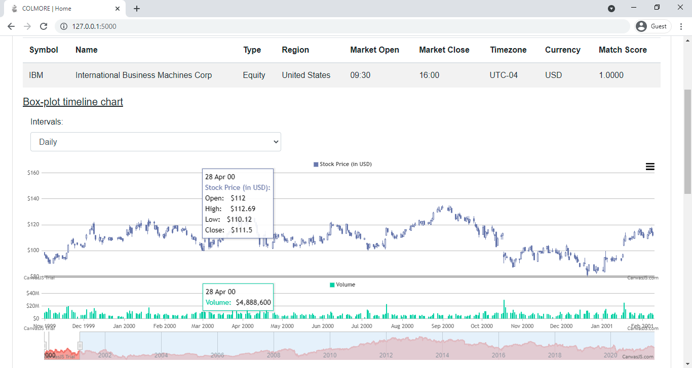
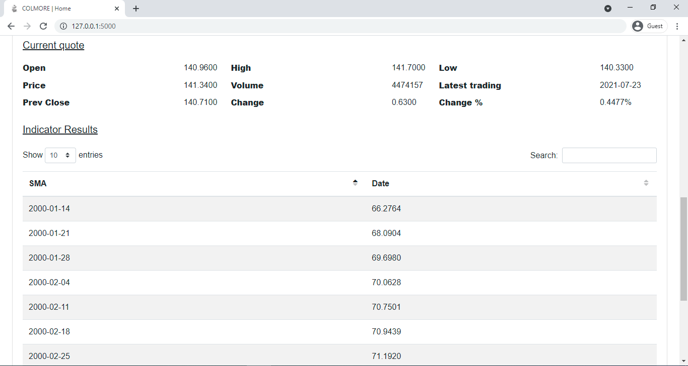
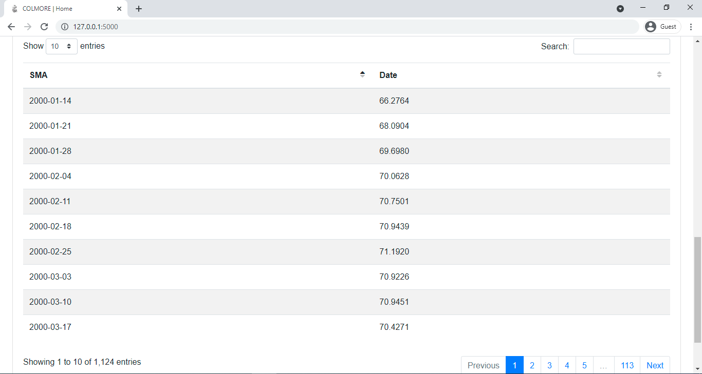

# COLMORE Stock browser App

## Prerequisites

* Python 3

## Setup

```bat
pip install virtualenv

virtualenv venv

source venv\Scripts\activate.bat

pip install -r requirements.txt

python app.py
```

## Screenshots

### Login


### Login fill form


### Home


### Autocomplete


### Autocomplete with results


### Additional details


### Box-plot chart


### Current quote details


### Indicator results
